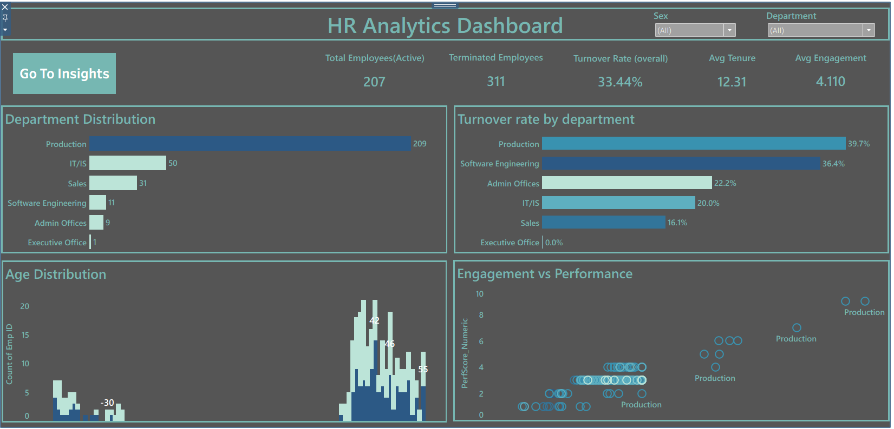
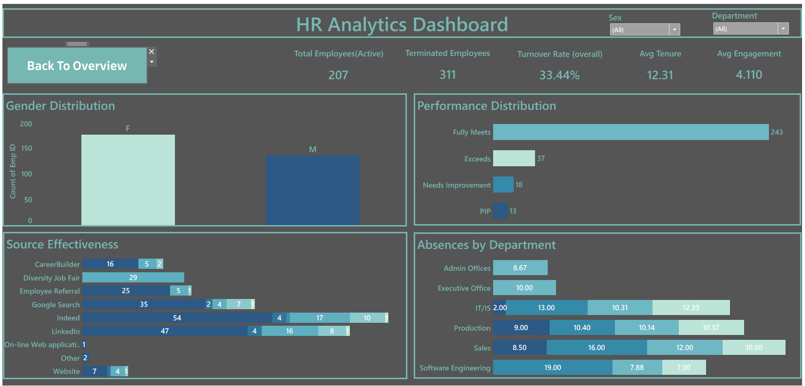

# **🧑‍💼 HR ANALYTICS DASHBOARD**

## **1. Project Name**
- **HR Analytics Dashboard**

## **2. Business Problem & Goal**
- **Problem:** The HR leadership needed visibility into workforce composition, turnover hotspots, and how engagement relates to performance to reduce attrition and improve productivity.  
- **Goal:** Build an interactive dashboard to monitor headcount, turnover, tenure, engagement, and performance so HR can take targeted retention and development actions.

## **3. My Role**
- Led the **end-to-end analytics** delivery: data cleaning, metrics design, visualization, and dashboard assembly.  
- Performed analysis to identify at-risk departments and produced actionable recommendations for HR stakeholders.

## **4. Data**
- **Dataset:** HRDataset.csv (employee records with department, age, tenure, engagement, performance rating, source of hire, absence data).  
- **Size:** ~500 rows (varies depending on dataset version).  
- **Source:** Internal HR data provided for the project (CSV / Excel export).

## **5. Tools & Techniques**
- **Tools:** Tableau (dashboard & visualization), Microsoft Excel (data cleanup).  
- **Techniques:**  
  - Data cleaning (tenure calculation, handling missing values, categorical standardization).  
  - Calculation of KPIs: Turnover Rate, Avg Tenure, Avg Engagement, headcount by department.  
  - Visualizations: KPI tiles, horizontal bar charts, histograms, scatter plots, stacked bars, and heatmaps.

## **6. Process (Step-by-step)**
- **Step 1 — Data Ingestion:** Imported HR CSV into Excel/Tableau and validated schema (columns & data types).  
- **Step 2 — Cleaning & Prep:** Standardized department names, computed tenure (months/years), encoded performance categories, handled nulls and duplicates.  
- **Step 3 — Metric Design:** Defined formulas for Turnover Rate, Active vs Terminated counts, Avg Tenure, and engagement scores.  
- **Step 4 — Exploratory Analysis:** Examined distribution by department, age, and hiring source to find patterns.  
- **Step 5 — Dashboard Build:** Built interactive Tableau sheets (Overview + Insights), added filters (Department, Sex), KPI tiles and drill-down navigation.  
- **Step 6 — Stakeholder Review:** Validated findings with HR lead and refined visuals and messaging.

## **7. Key Insights**
- **Turnover hotspots:** Production and Software Engineering showed the highest turnover rates — these departments need targeted retention programs.  
- **Engagement vs Performance:** Lower engagement cohorts correlated with lower performance scores — candidates for targeted engagement/training.  
- **Source effectiveness:** Certain hiring channels delivered higher-performing and more stable employees; reallocate sourcing spend accordingly.  
- **Absence patterns:** Some departments had higher absenteeism, which correlated with elevated turnover in a few cases.

## **8. Business Impact**
- **Targeted retention actions:** Dashboard enabled HR to prioritize interventions for high-turnover departments (reducing time/cost spent on reactive hiring).  
- **Better hiring decisions:** Insights into source effectiveness helped shift recruiting focus to channels producing more stable hires.  
- **Operational planning:** Avg Tenure and absence trends informed workforce planning, training allocation, and succession planning.  
- **Faster reporting:** Consolidated HR metrics into a single dashboard, reducing time spent producing manual reports.

## **9. Obstacles & Learnings**
- **Obstacle:** Inconsistent categorical values (departments, performance labels) and missing tenure dates required careful standardization.  
- **Learning:** Built a repeatable cleaning and transformation workflow that made future updates faster and more reliable.  
- **Learning:** Learned to design dashboards that balance summary KPIs with drill-down detail to satisfy both executives and HR analysts.

## 📊 Dashboard Overview – HR Analytics Dashboard

The **HR Analytics Dashboard** provides an interactive overview of workforce health and detailed insights for HR interventions. It includes:

### Overview Page
- **KPI tiles**: Total Employees (Active), Terminated Employees, Turnover Rate (overall), Avg Tenure, Avg Engagement.  
- **Department Distribution**: Headcount by department (horizontal bar).  
- **Turnover Rate by Department**: Quickly spot high-turnover departments.  
- **Age Distribution**: Employee age histogram to identify demographic concentrations.  
- **Engagement vs Performance**: Scatter plot to locate cohorts where low engagement aligns with low performance.

### Insights Page
- **Gender Distribution** and **Performance Distribution** visuals.  
- **Source Effectiveness**: Bar chart of hires by source with performance/retention overlays.  
- **Absences by Department**: Stacked bars showing average absence by department.

### Overview Screenshot

### Insights Screenshot

